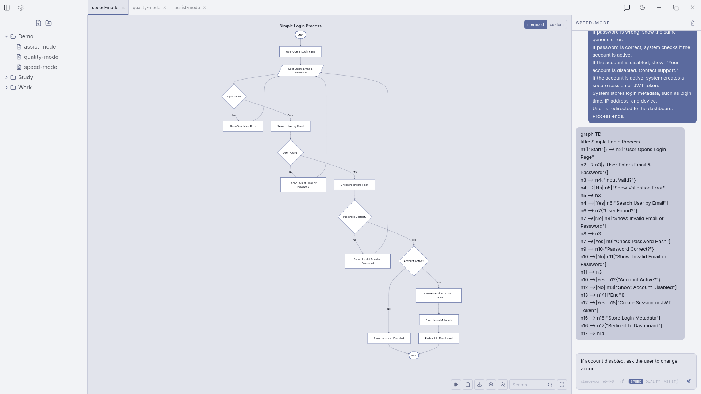
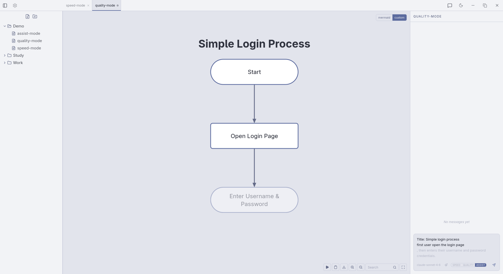
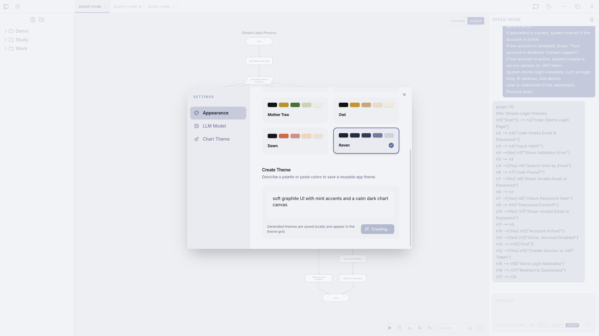
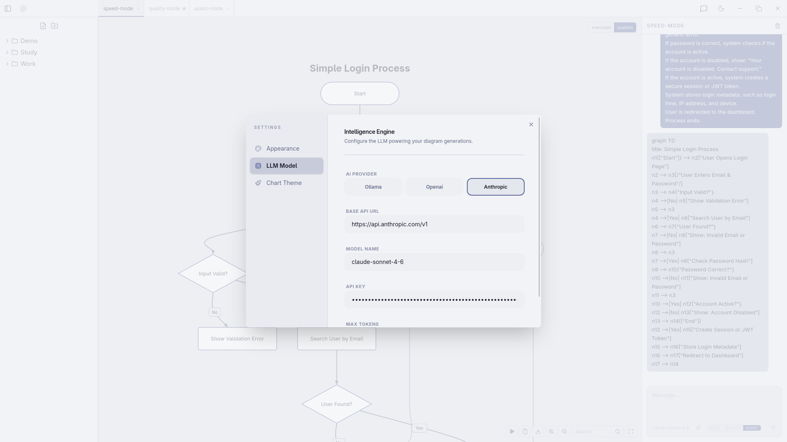
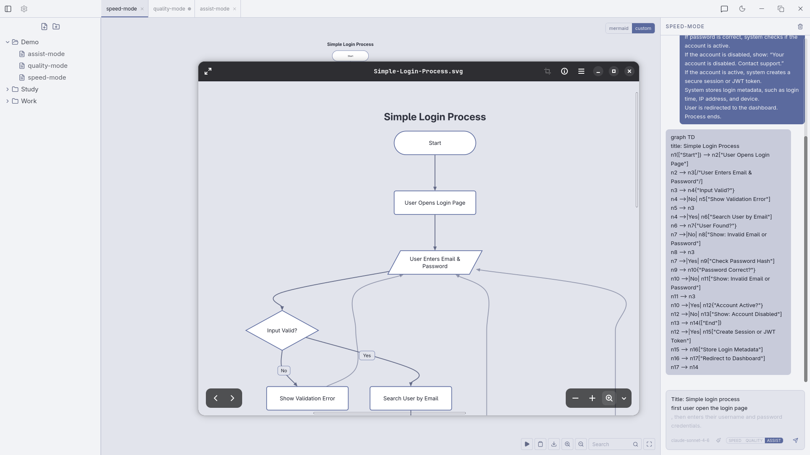
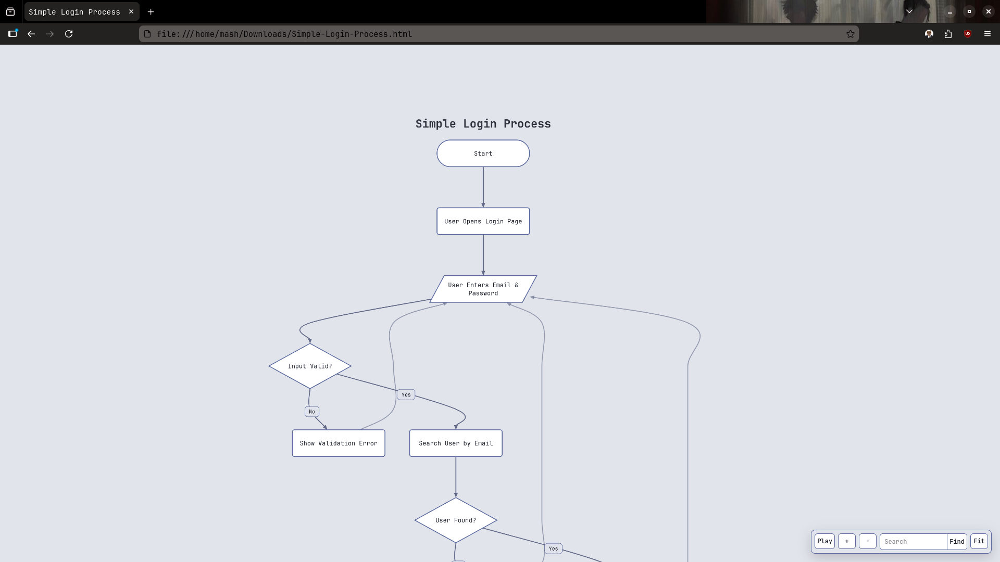
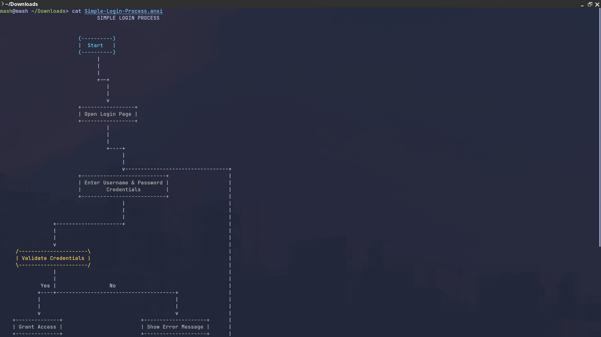

# Thought Flow

Thought Flow is an AI-powered desktop flowchart workspace for turning chat prompts into editable diagrams. It combines a local file vault, multi-provider LLM generation, live chart rendering, and export tools in a Tauri app built with React, TypeScript, Vite, and Tailwind CSS.

## Demo

[Watch Demo Video](https://github.com/Mohamed-Abbas-Homani/Thought-Flow/blob/main/docs/demo/thought-flow-demo.mp4)
## Screenshots

> Screenshot placeholders  
> Replace these with real screenshots when ready.

### Main Workspace




### Assist Mode



### Theme Generator



### LLM Settings



### SVG Export



### HTML Export



### ANSI Export



## Features

- Generate flowcharts from natural-language prompts.
- Edit existing diagrams with patch-style prompts.
- Choose between Speed, Quality, and Assist generation modes.
- Assist mode shows inline text completions and previews suggested chart nodes.
- Render diagrams with either Mermaid.js or a custom SVG renderer.
- Pan, zoom, fit-to-view, search nodes, and navigate diagrams in playback mode.
- Double-click to rename nodes, edge labels, and chart titles.
- Export diagrams as SVG, standalone HTML, ASCII/ANSI, and more.
- Standalone HTML exports include pan, zoom, fit, search, and playback controls.
- Generate application and chart themes from prompts.
- Use Ollama, OpenAI-compatible APIs, or Anthropic.
- Store every chart as a local chat session in the user vault.

## How It Works

Thought Flow stores each diagram as a chat-backed file in:

```text
~/Documents/thought-flow/
```

Each file contains chat messages, a delimiter, and a serialized chart graph:

```text
[{"role":"user","content":"...","timestamp":0}]
[+]
{"meta":{"type":"flowchart"},"nodes":[],"edges":[],"styles":{},"extensions":{}}
```

The generation pipeline is:

```text
Prompt -> LLM -> Mermaid -> ChartGraph -> Renderer -> Saved session
```

Mermaid is used as the interchange format from the model. The app parses it into an internal `ChartGraph`, validates and fixes structural issues, then renders it through either Mermaid.js or the custom SVG renderer.

## Generation Modes

**Speed** streams Mermaid directly and previews new charts while tokens arrive.

**Quality** runs a multi-stage chart pipeline for more polished diagrams.

**Assist** provides inline prompt completions as you type and previews suggested next nodes before accepting the suggestion.

## Renderers

Thought Flow includes two renderer modes:

- **Mermaid renderer**: uses Mermaid.js for familiar Mermaid output.
- **Custom renderer**: uses Dagre layout and custom SVG nodes, edges, playback, editing, and search.

Both renderers support:

- Node and edge editing.
- Chart title editing.
- Playback navigation with arrow keys.
- Clicking nodes during playback to jump the current highlight.
- Search that zooms to found nodes.
- Export controls.

## Exports

Supported export formats include:

- `svg`
- `html`
- `ascii` / ANSI terminal output

The standalone HTML export keeps the diagram interactive with pan, zoom, fit, search, and playback controls.

ANSI export can color node shapes in compatible terminals. Plain text editors may show ANSI escape codes instead of colors.

## Theme Generation

The settings panel can generate:

- Full application themes.
- Chart-only themes.

Theme generation is JSON-only and retries if the model returns invalid JSON.

Example prompt:

```text
soft graphite UI with mint accents and a calm dark chart canvas
```

## LLM Providers

Supported providers:

- Ollama
- OpenAI-compatible APIs
- Anthropic

Settings include provider URL, model name, API key where needed, and Anthropic max token configuration.

## Development

### Prerequisites

- Node.js
- npm
- Rust toolchain
- Tauri system dependencies for your platform

### Install

```bash
npm install
```

### Run Frontend Only

```bash
npm run dev
```

Vite runs on port `1420`.

### Run Desktop App

```bash
npm run tauri dev
```

### Build

```bash
npm run build
```

### Build Desktop App

```bash
npm run tauri build
```

## Project Structure

```text
src/
  App.tsx                         App shell and renderer selection
  components/
    ChatPanel.tsx                 Prompt input, chat history, generation modes
    MermaidRenderer.tsx           Mermaid.js renderer
    Flowchart/                    Custom SVG renderer
    sidebar/                      File explorer and vault UI
  lib/
    llm.ts                        LLM provider integration
    chart/                        Mermaid parsing, validation, quality pipeline
    exportDiagram.ts              SVG, HTML, raster, ASCII export
    asciiExport.ts                Terminal diagram renderer
    themeGenerator.ts             AI theme generation
  store/
    tabStore.ts                   Tabs, messages, chart persistence
    settingsStore.ts              Theme and LLM settings
    layoutStore.ts                Sidebar/chat layout state
src-tauri/
  src/                            Tauri backend entry points
  capabilities/                   Tauri permissions
```

## Tech Stack

- Tauri 2
- React 19
- TypeScript
- Vite
- Tailwind CSS v4
- Mermaid
- Dagre
- Zustand
- Lucide React

## Notes

- Node labels are generated with quoted Mermaid labels, for example `n2["Step"]`.
- `chartToMermaid` includes a custom `title:` line for Thought Flow. The Mermaid renderer strips it before passing Mermaid text to Mermaid.js, then displays the title separately.
- The vault is local-first and scoped to `~/Documents/thought-flow/`.
